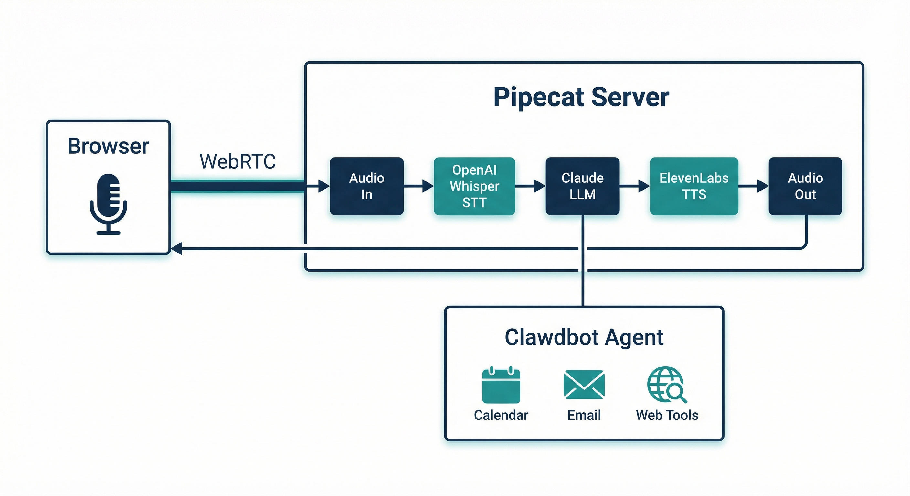

# Voxio Bot

A real-time voice AI assistant powered by [Clawdbot](https://github.com/clawdbot/clawdbot):
- **Brain**: [Clawdbot](https://clawdbot.com) (tools, memory, integrations)
- **STT**: MLX Whisper / OpenAI Whisper
- **Voice LLM**: Anthropic Claude (quick responses + handoff)
- **TTS**: ElevenLabs (customizable voice)
- **Transport**: WebRTC / Daily.co
- **Framework**: [Pipecat](https://pipecat.ai)

## Architecture



## Quick Start

### 1. Install uv (if not installed)
```bash
curl -LsSf https://astral.sh/uv/install.sh | sh
```

### 2. Set up environment
```bash
cd voxio-bot
cp .env.example .env
# Edit .env with your API keys
```

### 3. Install dependencies
```bash
uv sync
```

### 4. Run the bot (with auth)
```bash
uv run python run_auth.py --port 8086
```

### 5. Connect
Open http://localhost:8086/client in your browser and click **Connect**.

## Clawdbot Integration

Voxio Bot has bidirectional integration with Clawdbot:

### Handoff Tool (Voice → Clawdbot)

When users ask for something requiring tools (calendar, email, web search, etc.), Claude will use the `handoff_to_clawdbot` tool to delegate the task:

```
User: "What's on my calendar tomorrow?"
Claude: "I've sent that to the main system. I'll speak the results when they're ready."
→ Triggers: clawdbot wake --mode now --text "[Voice Task] Check calendar for tomorrow..."
```

### /speak Endpoint (Clawdbot → Voice)

Clawdbot can speak results back through active voice sessions:

```bash
# Check active sessions
curl https://voice.example.com/sessions

# Speak to the active session
curl -X POST https://voice.example.com/speak \
  -H "Content-Type: application/json" \
  -d '{"text": "You have two meetings tomorrow..."}'
```

**Endpoint: POST /speak**
```json
{
  "text": "Message to speak",
  "session_id": "optional - defaults to most recent session"
}
```

**Response:**
```json
{
  "success": true,
  "session_id": "abc123",
  "text_length": 45
}
```

**Endpoint: GET /sessions**
```json
{
  "active_count": 1,
  "session_ids": ["abc123"],
  "default_session": "abc123"
}
```

### Complete Flow

1. User speaks: "Search for best restaurants nearby"
2. Voice Claude uses `handoff_to_clawdbot` tool
3. Clawdbot receives the task via wake command
4. Clawdbot performs web search
5. Clawdbot POSTs results to `/speak`
6. Voxio Bot speaks the results to the user

## API Keys Required

### Anthropic (Claude LLM)
1. Go to https://console.anthropic.com/
2. Create an account or sign in
3. Navigate to API Keys
4. Create a new key
5. Add to `.env` as `ANTHROPIC_API_KEY`

### OpenAI (Whisper STT)
1. Go to https://platform.openai.com/api-keys
2. Create an account or sign in
3. Create a new key
4. Add to `.env` as `OPENAI_API_KEY`

### ElevenLabs (Text-to-Speech)
1. Go to https://elevenlabs.io/
2. Create an account or sign in
3. Go to Profile → API Keys
4. Create a new key
5. Add to `.env` as `ELEVENLABS_API_KEY`

## Configuration

### Environment Variables

| Variable | Description |
|----------|-------------|
| `ANTHROPIC_API_KEY` | Claude API key |
| `OPENAI_API_KEY` | OpenAI/Whisper API key |
| `ELEVENLABS_API_KEY` | ElevenLabs TTS key |
| `AUTH_USERNAME` | Basic auth username |
| `AUTH_PASSWORD` | Basic auth password |
| `VOICE_SERVER_URL` | Public URL for callbacks (e.g., `https://voice.example.com`) |

### Voice Selection

The default voice is "Roger" (`CwhRBWXzGAHq8TQ4Fs17`). To change it:

1. Browse ElevenLabs voices: https://elevenlabs.io/voice-library
2. Find a voice you like and copy its ID
3. Update `voice_id` in `bot.py`

### Model Selection

Claude model can be changed in `bot.py`:
- `claude-sonnet-4-20250514` (default, balanced)
- `claude-3-5-haiku-20241022` (faster, cheaper)
- `claude-opus-4-20250514` (most capable)

### VAD Settings

Voice Activity Detection parameters in `bot.py`:
- `stop_secs`: Silence duration before considering turn complete (default: 0.3s)

## Personality Customization

The assistant personality is defined in `VINSTON_SYSTEM_PROMPT` in `bot.py`. Default traits:
- Cool and collected
- Calm demeanor
- Professional problem-solver
- Concise responses (optimized for voice)
- Friendly but professional

Edit the system prompt to customize for your use case.

## Network & Security

### Default: Localhost Only

By default, Voxio Bot binds to `127.0.0.1` (localhost) for security reasons. This means:
- ✅ Only local connections are accepted
- ✅ No external exposure without explicit configuration
- ✅ Safe for development and home use

To access from other devices, you need a secure tunnel or VPN (see below).

### WebRTC & TURN Servers

WebRTC establishes peer-to-peer connections for real-time audio. In many network configurations (NAT, firewalls, VPNs), direct peer-to-peer connections fail. A **TURN server** relays traffic when direct connections aren't possible.

**When you need TURN:**
- Behind corporate firewalls
- Symmetric NAT (common in carrier-grade NAT)
- VPN connections
- Mobile networks

**TURN Server Options:**

| Provider | Type | Cost | Notes |
|----------|------|------|-------|
| [Cloudflare TURN](https://developers.cloudflare.com/calls/turn/) | Managed | Free tier + usage | Simple setup, global network, **recommended** |
| [Twilio TURN](https://www.twilio.com/docs/stun-turn) | Managed | Usage-based | Reliable, good docs |
| [Xirsys](https://xirsys.com/) | Managed | Free tier + paid | Popular for WebRTC |
| [coturn](https://github.com/coturn/coturn) | Self-hosted | Free | Run your own, requires server |
| [Pion TURN](https://github.com/pion/turn) | Self-hosted | Free | Go-based, lightweight |

**Cloudflare TURN Setup:**

1. Enable Cloudflare Calls in your dashboard
2. Get your TURN credentials:
   ```bash
   curl -X POST "https://rtc.live.cloudflare.com/v1/turn/keys/<key-id>/credentials/generate" \
     -H "Authorization: Bearer <api-token>" \
     -H "Content-Type: application/json" \
     -d '{"ttl": 86400}'
   ```
3. Configure in your WebRTC client:
   ```javascript
   const config = {
     iceServers: [
       { urls: 'stun:stun.cloudflare.com:3478' },
       { 
         urls: 'turn:turn.cloudflare.com:3478?transport=udp',
         username: '<username>',
         credential: '<credential>'
       }
     ]
   };
   ```

### Secure Remote Access Options

Since Voxio Bot only binds to localhost, you need a secure method to access it remotely:

#### Option 1: Tailscale (Recommended for Personal Use)

[Tailscale](https://tailscale.com/) creates a private mesh VPN between your devices.

```bash
# Install Tailscale on server and client devices
curl -fsSL https://tailscale.com/install.sh | sh
tailscale up

# Access via Tailscale IP
http://<tailscale-ip>:8086/client
```

**Pros:** Zero config, encrypted, works through NAT, free for personal use
**Cons:** Requires Tailscale on all client devices

#### Option 2: Cloudflare Tunnel + Zero Trust (Recommended for Production)

[Cloudflare Tunnel](https://developers.cloudflare.com/cloudflare-one/connections/connect-networks/) exposes localhost services through Cloudflare's network with authentication.

```bash
# Install cloudflared
brew install cloudflare/cloudflare/cloudflared

# Create tunnel
cloudflared tunnel create voxio-bot
cloudflared tunnel route dns voxio-bot voice.yourdomain.com

# Create config (~/.cloudflared/config.yml)
tunnel: <tunnel-id>
credentials-file: ~/.cloudflared/<tunnel-id>.json
ingress:
  - hostname: voice.yourdomain.com
    service: http://localhost:8086
  - service: http_status:404

# Run tunnel
cloudflared tunnel run voxio-bot
```

**Add Zero Trust authentication:**
1. Go to Cloudflare Zero Trust dashboard
2. Create an Access Application for `voice.yourdomain.com`
3. Add authentication (email OTP, SSO, etc.)

**Pros:** Public URL with auth, DDoS protection, global edge
**Cons:** Requires domain on Cloudflare, more setup

#### Option 3: Nginx Reverse Proxy + WireGuard

For self-hosted infrastructure:

```nginx
# /etc/nginx/sites-available/voxio-bot
server {
    listen 443 ssl;
    server_name voice.yourdomain.com;
    
    ssl_certificate /path/to/cert.pem;
    ssl_certificate_key /path/to/key.pem;
    
    location / {
        proxy_pass http://127.0.0.1:8086;
        proxy_http_version 1.1;
        proxy_set_header Upgrade $http_upgrade;
        proxy_set_header Connection "upgrade";
        proxy_set_header Host $host;
    }
}
```

Combine with WireGuard VPN for access control.

#### Option 4: SSH Tunnel (Quick & Dirty)

For temporary access:

```bash
# On client machine
ssh -L 8086:localhost:8086 user@server

# Then access locally
http://localhost:8086/client
```

**Pros:** No additional software, works immediately
**Cons:** Manual, temporary, requires SSH access

### Security Best Practices

1. **Never bind to 0.0.0.0** without authentication
2. **Always use HTTPS** in production (Cloudflare Tunnel handles this)
3. **Enable basic auth** (`run_auth.py` does this by default)
4. **Rotate TURN credentials** regularly (use short TTLs)
5. **Monitor active sessions** via `/sessions` endpoint
6. **Use Zero Trust** for production deployments

## Troubleshooting

### "Module not found" errors
```bash
uv sync --reinstall
```

### Microphone not working
- Check browser permissions
- Ensure microphone is not in use by another app
- Try a different browser (Chrome recommended)

### High latency
- Try `eleven_turbo_v2_5` for TTS (already default)
- Reduce `stop_secs` VAD parameter
- Check your network connection

### Connection fails
- WebRTC may be blocked by VPN/firewall
- **Add a TURN server** (see above) — this fixes most connection issues
- Try disabling VPN
- Check if UDP traffic is allowed

### Handoff not working
- Ensure `clawdbot` command is in PATH
- Check Clawdbot is running
- Check logs: `tail -f /tmp/voxio-bot.log`

## Project Structure

```
voxio-bot/
├── bot.py              # Main Pipecat bot with Clawdbot integration
├── run_auth.py         # Server runner with auth + /speak endpoint
├── pyproject.toml      # Python dependencies
├── .env.example        # Environment template
├── .env                # Your API keys (gitignored)
├── docs/
│   └── architecture.png
└── README.md
```

## License

MIT
